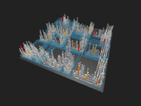
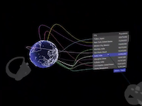
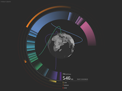
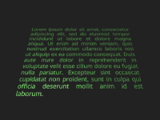
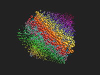

Troika is a collection of JavaScript tools for creating interactive graphics in the browser, with a focus on 3D/WebGL, and optimized for data visualization use cases.

The provided tools fall into two main categories:

- The [_Troika Framework_](#troika-framework), a fully featured framework for managing entire scenes with rich interactivity and high performance, and
- A growing set of [_other tools for Three.js_](#troika-threejs-tools), that do not depend on that framework.

The Troika project's main goal is to take aspects of developing interactive graphics that you almost always need, but are difficult to manage yourself, and make them as easy as possible.

## Troika Framework

The Troika JavaScript framework is a system for managing complex imperative graphics APIs with a simple declarative model. It provides:

* A component architecture that encapsulates complex graphics APIs behind simple facade objects
* Declarative description of the scene's structure and how it should change over time
* CSS-like declarative animations and transitions
* DOM-like interaction event handling
* Performance optimizations

At its core, the Troika framework manages a simple mapping from a declarative scene descriptor to a tree of special objects called [_Facades_](troika-core/facades.md). Each `Facade` is a component that knows how to synchronize its state, set as flat properties by the scene descriptor, to a more complex underlying API.

On top of that, Troika builds in some things like an event subscription model and declarative animations and transitions for facade properties.

[Learn more about Troika core concepts.](troika-core/facades.md)

### Troika 3D

Creating interactive 3D scenes with WebGL is Troika's first focus. It uses [Three.js](https://threejs.org) for the heavy lifting of managing WebGL state, and for its solid scene graph model, 3D primitives and math utilities, and shader library.

Troika manages the Three.js renderer and common things like world matrix calculations and raycasting for pointer events. Otherwise, it has no knowledge of any 3D primitives; it's up to you to set up your Three.js meshes, geometries, materials, etc. and update them in your `Object3DFacade` implementations. A solid understanding of Three.js's model is therefore still required.

As a very rough analogy: if Three.js provides a DOM for WebGL, then you could consider Troika to be like ReactJS for managing that DOM. It simplifies things, but you still need to know the DOM.

Troika 3D also provides some more advanced capabilities like: position-synced [HTML overlays](troika-3d/html-overlays.md), an easy-to-use [GPU instancing](troika-3d/instancing.md) abstraction, a system for creating [flexbox user interfaces](troika-3d-ui/index.md), and [WebXR support](troika-xr/index.md).

[Learn more about Troika 3D.](troika-3d/index.md)

### Troika 2D

As a separate package, Troika also provides the ability to define graphics using the 2D Canvas API, using the same scene/facade patterns and core conveniences like animations and pointer events.

This can be nice on its own when you don't need 3D, but is also useful as a graceful fallback for when WebGL isn't available in the browser.

[Learn more about Troika 2D.](troika-2d/index.md)

## Troika Three.js Tools

Over time, development of the Troika framework has produced certain tools and techniques that are generally useful for Three.js development. It has become our goal to extract as many of these tools as possible from the Troika framework so they can be used in pure Three.js projects or within other frameworks like AFrame or react-three-fiber.

Some of these tools include:

- [troika-three-text](./troika-three-text/index.md): High quality, high performance text rendering for Three.js.
- [createDerivedMaterial](./troika-three-utils/createDerivedMaterial.md): A utility for extending any Three.js material with custom shader code.
- [InstancedUniformsMesh](./three-instanced-uniforms-mesh): An extension of Three's `InstancedMesh` that allows setting any shader uniform per instance.
- ...and others.

## Browser support

Troika's framework and tools are generally intended to support in the same browsers as Three.js does. See the [Three.js browser support](https://threejs.org/docs/#manual/en/introduction/Browser-support) docs for more details.

All source files are ES2015 modules, and can be used un-transpiled in modern browsers supporting `<script type="module">`, though you'll probably still want to combine/tree-shake them with a module-aware build pipeline like [Webpack](https://webpack.js.org/) or [Rollup](https://rollupjs.org/). For older browsers, ES5-transpiled files are provided.

## Origins

Troika was developed starting in 2016 by the ProtectWise front end engineering team as an internal tool to enable rapid development of interactive 3D and 2D data visualizations in the ProtectWise Visualizer. As it matured and became an essential part of our toolkit, we realized it could be useful to the broader web developer community and decided to release it as an open source project in early 2019.

Since then, ProtectWise has been acquired by [Verizon Business](https://www.verizon.com/business/products/security/managed-detection-response-services/network-detection-response/), where Troika continues to be used for developing new 3D data visualizations on screens and in immersive WebXR environments.
