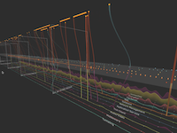

The `troika-3d` package provides the ability to create interactive 3D scenes with Troika's declarative framework. It uses [Three.js](https://threejs.org) as its underlying WebGL renderer, giving you access to Three's full set of tools and its excellent community.

It does very little to abstract away from Three's API, and you will need to know the Three.js object model well to use it. But through its primary facade class, [`Object3DFacade`](./objects.md#object3dfacade), it gives you a straightforward way to:

- componentize your 3D objects
- manage them all together declaratively
- apply automatic transitions and animations
- make them interactive with pointer events
- optimize for the best frame rate

[](https://troika-examples.netlify.com/#citygrid)
[](https://troika-examples.netlify.app/#globeConnections)
[](https://troika-examples.netlify.com/#instanceable)
[](https://twitter.com/lojjic/status/1357102689210019844)


## Installation

```sh
npm install troika-3d
```

You will also need to install a compatible version of [Three.js](https://threejs.org). See the [Setup](../getting-started/setup.md#threejs) page for details about Three.js versions.

```sh
npm install three
```


## Next Steps

If you haven't already, you should familiarize yourself with the Troika framework's [Core Concepts](../troika-core/facades.md). Troika 3D builds on those.

Then, move on to [Creating a 3D Scene](./scenes.md) and [Adding 3D Objects](./objects.md) to it.
